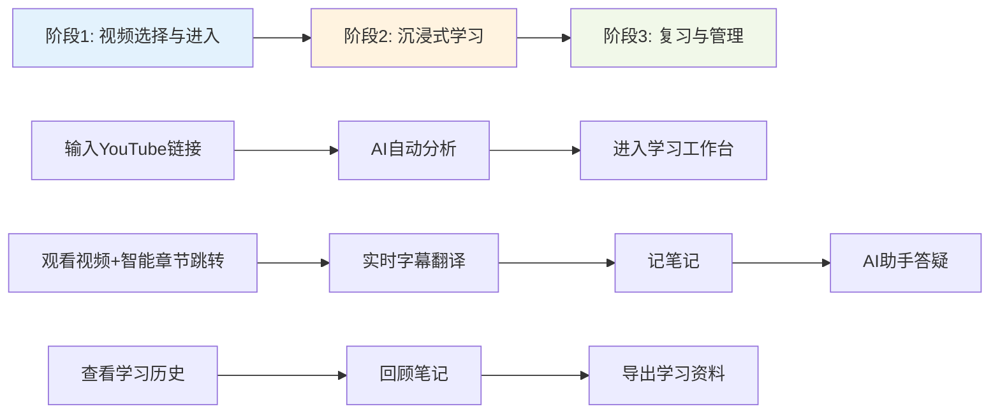
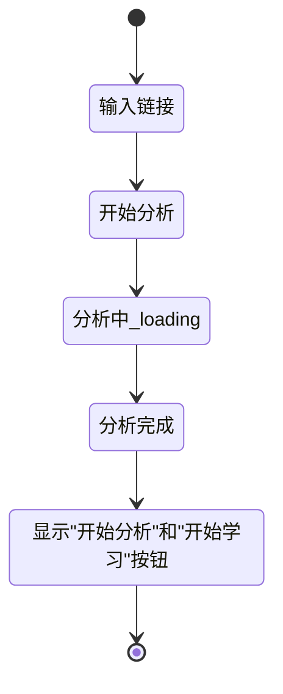
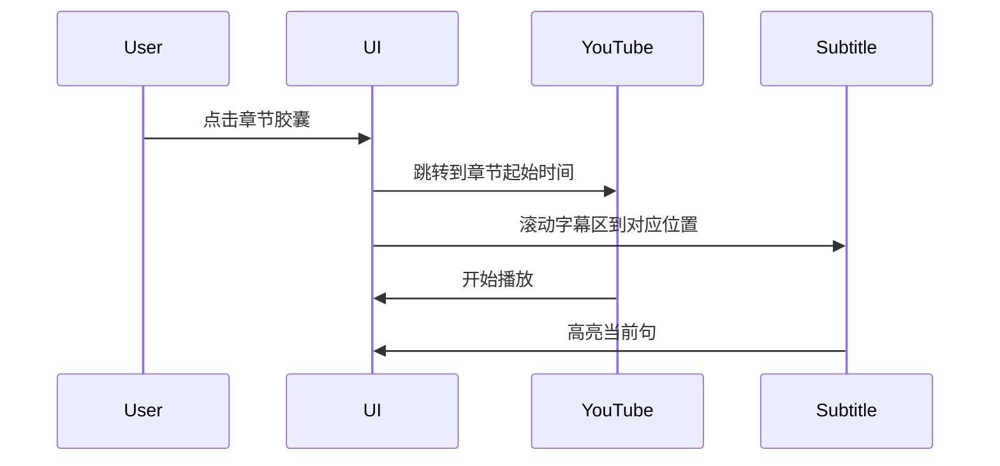

# PRD-001: YouTube 学习工作台

**版本**: v1.0  
**创建日期**: 2026-01-29  
**产品负责人**: [待填写]  
**状态**: 待评审

---

## 📋 文档概览

### 产品愿景

将现有的"YouTube视频分析工具"升级为一个**沉浸式学习工作台**，专为YouTube长视频深度学习场景设计。解决学习者在观看教育/技术视频时的核心痛点：不知道视频讲了什么、无法快速定位内容、语言障碍、无法边学边记、缺乏即时答疑。

### 核心价值主张

- 🎯 **智能章节导航** - AI自动分段+可视化时间轴，一眼看清视频结构
- 🌐 **多语言字幕实时翻译** - 支持4种翻译引擎，逐句对照
- 📝 **边看边记笔记** - 关联时间轴的笔记系统，支持视频截图
- 🤖 **AI学习助手** - 基于视频内容的智能问答，随时解惑

### 目标用户

- **在线学习者** - 通过YouTube学习技术/语言/职业技能
- **研究人员** - 观看学术讲座、会议视频并记录要点
- **内容创作者** - 分析竞品视频、提取创意灵感
- **跨语言学习者** - 需要字幕翻译辅助理解

---

## 🗺️ 用户旅程地图

整个产品按用户使用流程分为 **3个核心阶段**：



---

## 📖 用户故事集

### 阶段1: 视频选择与进入学习

#### US-01: 主页新增"开始学习"入口

**作为** 学习者  
**我希望** 在主页分析完视频后，看到"开始学习"按钮  
**以便于** 快速进入学习工作台

**交互流程**



**UI线框图**

```
┌─────────────────────────────────────────────────────┐
│  YouTube 视频分析工具                                │
│                                                     │
│  ┌───────────────────────────────────────────────┐ │
│  │ 请输入YouTube视频链接                          │ │
│  └───────────────────────────────────────────────┘ │
│                                                     │
│  [  开始分析  ]  [  开始学习  ]  ← 新增按钮         │
│                                                     │
│  ┌─ 分析详情 ───────────────────────────────────┐  │
│  │ 视频标题: ...                                 │  │
│  │ 综合评分: 8.5/10                              │  │
│  │ ...                                           │  │
│  └───────────────────────────────────────────────┘  │
└─────────────────────────────────────────────────────┘
```

**验收标准**

- [ ] "开始学习"按钮位于"开始分析"按钮右侧，同一行
- [ ] 点击"开始学习"按钮，在**新标签页**打开 `/learning/[videoId]` 页面
- [ ] 原标签页保留在主页，不关闭
- [ ] 未分析视频时，"开始学习"按钮置灰不可点击
- [ ] Hover"开始学习"按钮显示tooltip："进入沉浸式学习模式"

**注意事项**

- 新标签页打开使用 `window.open()` 或 `target="_blank"`
- 需要将当前videoId作为路由参数传递

---

#### US-02: 学习历史记录侧边栏

**作为** 学习者  
**我希望** 在学习页面左侧看到我的学习历史  
**以便于** 快速切换到之前学习过的视频

**UI线框图**

```
┌─学习历史──┬────────────────────────────────────────┐
│           │  YouTube 学习工作台                     │
│ 视频1     ├────────────────────────────────────────┤
│ ┌─────┐   │                                        │
│ │缩略图│   │                                        │
│ └─────┘   │        [主要内容区]                     │
│ 标题...   │                                        │
│ 观看:2h   │                                        │
│ 进度:70%  │                                        │
│ 2026-1-28 │                                        │
│           │                                        │
│ 视频2     │                                        │
│ ┌─────┐   │                                        │
│ │缩略图│   │                                        │
│ └─────┘   │                                        │
│ 标题...   │                                        │
│ 观看:30m  │                                        │
│ 进度:100% │                                        │
│ 2026-1-27 │                                        │
│           │                                        │
│ ───────── │                                        │
│           │                                        │
│ [按日期▼] │                                        │
└───────────┴────────────────────────────────────────┘
```

**业务规则**

- **历史记录来源**: 本地IndexedDB存储，每次打开学习页面自动记录
- **排序逻辑**: 默认按日期倒序（最近学习的在最上方）
- **分组规则**:
  - 今天
  - 昨天
  - 本周
  - 更早
- **学习进度计算**: `观看时长 / 视频总时长 * 100%`
- **观看时间累计**: 每次播放器时间变化时更新

**验收标准**

- [ ] 侧边栏宽度250px，可折叠（点击边缘箭头）
- [ ] 每条历史记录显示：缩略图(120x68px)、视频标题(最多2行省略)、观看时长、学习进度条、最后观看日期
- [ ] 默认按日期分组展示（可切换为"全部"不分组）
- [ ] 点击任意历史记录，在**新标签页**打开对应学习页面
- [ ] 当前正在学习的视频，在列表中高亮显示（蓝色边框）
- [ ] 移动端：侧边栏默认收起，显示汉堡菜单按钮

**数据结构**

```typescript
interface LearningHistory {
  videoId: string;
  title: string;
  thumbnail: string;
  duration: number; // 视频总时长(秒)
  watchedTime: number; // 观看时长(秒)
  progress: number; // 学习进度 0-100
  lastWatchedAt: timestamp;
  createdAt: timestamp;
}
```

---

### 阶段2: 沉浸式学习核心功能

#### US-03: YouTube播放器集成

**作为** 学习者  
**我希望** 在学习页面看到嵌入的YouTube播放器  
**以便于** 直接播放视频无需跳转

**UI线框图**

```
┌──────────────────────────────────────────────────┐
│  [ ← 返回主页 ]  YouTube学习工作台 - 视频标题     │
├──────────────────────────────────────────────────┤
│                                                  │
│  ┌────────────────────────────────────────────┐ │
│  │                                            │ │
│  │         YouTube 播放器 (16:9)              │ │
│  │         [可拖拽调整大小]                    │ │
│  │                                            │ │
│  │  ▶────────○──────────  [⚙️ 设置]          │ │
│  └────────────────────────────────────────────┘ │
│                                                  │
└──────────────────────────────────────────────────┘
```

**功能需求**

- **播放器比例**: 默认16:9，但支持拖拽调整大小
- **拖拽功能**: 播放器右下角显示拖拽手柄，可调整宽度/高度
- **最小尺寸**: 宽度不低于480px，高度不低于270px
- **最大尺寸**: 不超过容器宽度的80%
- **播放控制**:
  - 倍速播放: 0.25x, 0.5x, 0.75x, 1x, 1.25x, 1.5x, 1.75x, 2x
  - 画中画功能(PiP)
  - 全屏功能
  - 音量控制
- **进度保存**: 播放时间每10秒自动保存到IndexedDB

**技术方案**

```typescript
// 使用 react-youtube
import YouTube from 'react-youtube';

const opts = {
  height: '390',
  width: '640',
  playerVars: {
    autoplay: 0,
    controls: 1,
    modestbranding: 1,
    rel: 0,
  },
};

<YouTube videoId={videoId} opts={opts} onReady={onPlayerReady} />
```

**验收标准**

- [ ] 播放器加载时显示loading动画
- [ ] 视频加载失败时显示错误提示："视频加载失败，请检查链接"
- [ ] 拖拽调整大小时保持16:9比例
- [ ] 播放器设置菜单支持倍速选择(0.25x-2x)
- [ ] 画中画按钮点击后，视频浮窗在页面右下角
- [ ] 全屏模式下，退出全屏返回原位置

---

#### US-04: AI智能章节进度条

**作为** 学习者  
**我希望** 在播放器下方看到AI自动分段的章节时间轴  
**以便于** 快速了解视频结构并跳转到感兴趣的部分

**UI线框图（参考用户提供的图2）**

```
┌──────────────────────────────────────────────────────────────────┐
│  [🔖 引言]     [📖 核心概念]    [💡 实战案例]     [✅ 总结]      │
│  ●─────────────●──────────────●──────────────●──────────────    │
│  0:00          2:30           8:15           15:40              │
│                                                                  │
│  当前: 15:20 / 总计: 20:10                      ▶ Play All      │
└──────────────────────────────────────────────────────────────────┘
```

**悬停详情弹窗**

```
┌────────────────────────────────────────┐
│  📖 核心概念 (2:30 - 8:15)             │
│  ────────────────────────────────────  │
│  本段详细讲解了React Hooks的核心原理， │
│  包括useState、useEffect的底层实现机制， │
│  以及自定义Hook的最佳实践。            │
│  关键词: Hooks, useState, useEffect   │
└────────────────────────────────────────┘
```

**业务规则**

**AI分段策略**:

1. 获取视频完整字幕
2. 调用DeepSeek API分析字幕内容
3. 基于主题变化自动切分段落（每段2-8分钟）
4. 为每段生成：
   - **简略标签**: 3-6字概括（如"引言与背景"）
   - **详细说明**: 50-100字段落摘要
   - **章节类型**: 引言/正文/案例/总结（用于配色）

**章节颜色规则**:

- 🔖 引言: `#64B5F6` (蓝色)
- 📖 正文: `#81C784` (绿色)
- 💡 案例: `#FFB74D` (橙色)
- ✅ 总结: `#E57373` (红色)

**AI Prompt模板**:

```
你是视频内容分析专家。请分析以下YouTube视频的字幕，将内容分段：

视频字幕:
[字幕内容]

要求:
1. 根据主题变化自动切分段落，每段建议2-8分钟
2. 为每段生成:
   - start_time: 起始时间(秒)
   - end_time: 结束时间(秒)
   - type: 引言|正文|案例|总结
   - short_title: 3-6字标题
   - description: 50-100字详细说明
   - keywords: 3-5个关键词

返回JSON格式:
{
  "chapters": [
    {
      "start_time": 0,
      "end_time": 150,
      "type": "引言",
      "short_title": "课程介绍",
      "description": "...",
      "keywords": ["React", "Hooks"]
    }
  ]
}
```

**交互行为**



**验收标准**

- [ ] 打开学习页面时自动触发AI分段分析（显示loading："AI分析中..."）
- [ ] 章节时间轴显示在YouTube播放器正下方
- [ ] 每个章节胶囊显示：图标+简略标签+时长
- [ ] 鼠标悬停章节胶囊500ms后，弹出详细说明弹窗
- [ ] 点击章节胶囊，YouTube播放器跳转到对应时间点
- [ ] 点击章节胶囊，字幕区自动滚动到对应段落并高亮
- [ ] 当前播放时间点所在的章节，胶囊显示激活态（加粗边框）
- [ ] 分析失败时显示错误："AI分段失败，请重试"，并提供"重新分析"按钮

**性能要求**

- AI分析时间控制在30秒内
- 分析过的视频结果缓存在IndexedDB（7天有效期）
- 缓存命中时，直接加载章节数据（<1秒）

---

#### US-05: 实时字幕翻译区

**作为** 学习者  
**我希望** 在视频右侧看到实时同步的字幕和翻译  
**以便于** 像读文章一样理解视频内容

**UI线框图**

```
┌─────────────────────────────────────────────────────┐
│  📺 实时字幕翻译                                      │
│  ┌────────────────────────────────────────────────┐ │
│  │ [语言: 英文 ▼] [翻译: 中文 ▼] [👁️] [🔍] [📥]   │ │
│  └────────────────────────────────────────────────┘ │
│                                                     │
│  ┌────────────────────────────────────────────────┐ │
│  │ 00:15                                          │ │
│  │ This is the first sentence of the video.      │ │
│  │ 这是视频的第一句话。                            │ │
│  │ ────────────────────────────────────────────── │ │
│  │ 00:23  ← 当前播放高亮                           │ │
│  │ ► Let's dive into the core concepts.          │ │
│  │   让我们深入了解核心概念。                      │ │
│  │ ────────────────────────────────────────────── │ │
│  │ 00:35                                          │ │
│  │ First, we need to understand...               │ │
│  │ 首先，我们需要理解...                          │ │
│  │ ────────────────────────────────────────────── │ │
│  │ ...                                            │ │
│  └────────────────────────────────────────────────┘ │
└─────────────────────────────────────────────────────┘
```

**功能清单**

**1. 语言选择下拉框**

- 切换原文字幕语言（如果YouTube提供多语言字幕）
- 选项：中文、英文、日文（根据YouTube API返回的可用字幕）
- 优先级：优先使用YouTube官方字幕 > AI翻译字幕

**2. 翻译引擎下拉框**

```
┌──────────────────────┐
│ 翻译引擎              │
├──────────────────────┤
│ ✓ DeepSeek (默认)    │
│   Google Translate   │
│   DeepL              │
│   GLM-4              │
├──────────────────────┤
│ ⚙️ API配置           │
└──────────────────────┘
```

- 支持4种翻译引擎切换
- 默认使用DeepSeek（使用你的API Key）
- 点击"API配置"打开设置弹窗，允许用户输入自己的API Key

**3. 翻译目标语言**

- 支持：中文、英文、日文、韩文
- 翻译方式：逐句翻译（每句原文 + 译文成对显示）

**4. 👁️ 显示/隐藏翻译**

- 点击眼睛图标，切换翻译文本的显示/隐藏
- 隐藏时只显示原文
- 状态记忆（刷新页面保持）

**5. 🔍 搜索定位**

```
┌─────────────────────────────────────┐
│ 🔍 搜索字幕...                       │
│ ┌─────────────────────────────────┐ │
│ │ React Hooks                     │ │
│ └─────────────────────────────────┘ │
│                                     │
│ 找到 3 处匹配:                       │
│ ┌─────────────────────────────────┐ │
│ │ 00:23 - ...dive into React...   │ │
│ │ 05:12 - ...Hooks API...         │ │
│ │ 12:45 - ...custom Hooks...      │ │
│ └─────────────────────────────────┘ │
└─────────────────────────────────────┘
```

- 实时搜索原文和译文
- 点击搜索结果，字幕区滚动到对应位置 + YouTube跳转

**6. 📥 下载字幕**

```
┌──────────────────────────┐
│ 下载字幕                  │
├──────────────────────────┤
│ □ 纯原文 (EN)            │
│ ✓ 双语对照 (EN-CN)       │
├──────────────────────────┤
│ 格式:                    │
│ ○ SRT (带时间戳)         │
│ ● TXT (纯文本)           │
│ ○ Word (.docx)           │
│ ○ Markdown (.md)         │
├──────────────────────────┤
│      [ 下载 ]            │
└──────────────────────────┘
```

**业务规则**

**实时同步逻辑**:

```typescript
// 监听YouTube播放器时间
onPlayerStateChange = (currentTime) => {
  // 查找当前时间对应的字幕
  const currentSubtitle = subtitles.find(
    (sub) => currentTime >= sub.start && currentTime <= sub.end
  );

  // 滚动到当前字幕（底部对齐）
  scrollToSubtitle(currentSubtitle.id, { block: 'end' });

  // 高亮当前字幕
  highlightSubtitle(currentSubtitle.id);
};
```

**分页加载**:

- 初始加载前100条字幕
- 滚动到底部时加载下一批100条
- 使用虚拟滚动优化性能（推荐 `react-window`）

**翻译缓存**:

```typescript
interface TranslationCache {
  videoId: string;
  engine: 'deepseek' | 'google' | 'deepl' | 'glm';
  sourceLang: string;
  targetLang: string;
  translations: Array<{
    index: number;
    original: string;
    translated: string;
  }>;
  cachedAt: timestamp;
}
```

- 缓存周期：7天
- 缓存键：`${videoId}_${engine}_${sourceLang}_${targetLang}`

**验收标准**

- [ ] 字幕区高度占右侧区域的60%
- [ ] 当前播放字幕始终保持在可视区域底部20%处
- [ ] 高亮当前字幕使用背景色 `#FFF9C4`（浅黄色）
- [ ] 切换翻译引擎后，自动重新翻译并更新字幕
- [ ] 搜索功能支持高亮所有匹配项
- [ ] 下载SRT格式时，时间戳格式符合标准：`00:00:15,000 --> 00:00:18,500`
- [ ] 移动端：字幕区在播放器下方，全宽显示

---

#### US-06: 随手笔记功能

**作为** 学习者  
**我希望** 在学习视频的同时记录笔记  
**以便于** 保存关键要点和个人思考

**UI线框图**

```
┌─────────────────────────────────────────────────────┐
│  📝 随手笔记                          [+ 新增笔记]   │
│  ┌────────────────────────────────────────────────┐ │
│  │ 🔍 搜索笔记...                                  │ │
│  └────────────────────────────────────────────────┘ │
│                                                     │
│  ┌────────────────────────────────────────────────┐ │
│  │ 📌 React Hooks原理               [编辑] [删除] │ │
│  │ ⏱️ 00:05:23  📅 2026-01-29 10:30               │ │
│  │ ────────────────────────────────────────────── │ │
│  │ useState内部使用了Fiber架构的memoizedState...  │ │
│  │ 每次调用都会...                                │ │
│  │                                                │ │
│  │ 🖼️ [视频截图缩略图]                            │ │
│  └────────────────────────────────────────────────┘ │
│                                                     │
│  ┌────────────────────────────────────────────────┐ │
│  │ 📌 自定义Hook最佳实践            [编辑] [删除] │ │
│  │ ⏱️ 00:12:45  📅 2026-01-29 10:45               │ │
│  │ ────────────────────────────────────────────── │ │
│  │ Q: 什么是自定义Hook？                          │ │
│  │ A: 自定义 Hook 是一个 JavaScript 函数...       │ │
│  └────────────────────────────────────────────────┘ │
└─────────────────────────────────────────────────────┘
```

**编辑笔记弹窗**

```
┌──────────────────────────────────────────────────┐
│  ✏️ 编辑笔记                          [×]        │
├──────────────────────────────────────────────────┤
│  标题:                                           │
│  ┌────────────────────────────────────────────┐ │
│  │ React Hooks原理                            │ │
│  └────────────────────────────────────────────┘ │
│                                                  │
│  内容: (支持Markdown)                            │
│  ┌────────────────────────────────────────────┐ │
│  │ ## 核心要点                                │ │
│  │ - useState内部使用Fiber架构                │ │
│  │ - 每次渲染都会...                          │ │
│  │                                            │ │
│  │                                            │ │
│  └────────────────────────────────────────────┘ │
│                                                  │
│  📸 视频截图: [添加当前画面]                     │
│  ⏱️ 时间戳: 00:05:23 (自动记录)                  │
│                                                  │
│  [ 取消 ]                         [ 保存笔记 ]   │
└──────────────────────────────────────────────────┘
```

**功能需求**

**1. 新增笔记**

- 点击"+ 新增笔记"按钮，打开编辑弹窗
- 自动记录：
  - 当前视频时间戳
  - 创建时间
  - 关联videoId
- 可选：添加当前视频画面截图

**2. 编辑笔记**

- 支持Markdown语法（使用 `react-markdown` 渲染预览）
- 笔记内容实时保存（防止丢失）
- 显示最后修改时间

**3. 删除笔记**

- 删除前弹出确认弹窗："确定要删除这条笔记吗？"
- 支持批量删除（多选模式）

**4. 搜索笔记**

- 搜索范围：所有视频的笔记（全局搜索）
- 搜索字段：标题 + 内容
- 搜索结果显示：笔记所属视频标题 + 匹配片段

**5. 笔记卡片交互**

- 点击笔记卡片，展开/收起完整内容
- 点击时间戳，视频跳转到对应时间点
- 点击视频截图，全屏预览

**数据结构**

```typescript
interface Note {
  id: string;
  videoId: string;
  videoTitle: string; // 冗余存储，方便搜索时显示
  title: string;
  content: string; // Markdown格式
  timestamp: number; // 视频时间点(秒)
  screenshot?: string; // Base64 or URL
  createdAt: timestamp;
  updatedAt: timestamp;
}
```

**验收标准**

- [ ] 笔记区高度占右侧区域的40%
- [ ] 新增笔记时，编辑器获得焦点
- [ ] 笔记列表按创建时间倒序排列
- [ ] Markdown预览支持：标题、列表、粗体、斜体、代码块
- [ ] 视频截图使用 `<canvas>` 捕获当前YouTube画面
- [ ] 点击笔记时间戳，YouTube播放器跳转并开始播放
- [ ] 全局搜索结果按视频分组展示
- [ ] 删除笔记后，立即从列表移除（带淡出动画）
- [ ] 数据存储在IndexedDB，支持离线访问

---

#### US-07: AI学习助手浮窗

**作为** 学习者  
**我希望** 在观看视频时随时向AI提问  
**以便于** 即时解答学习中的疑惑

**UI线框图 - 浮窗收起状态**

```
┌─────────────────────────────────┐
│                                 │
│                                 │
│                                 │
│                      ┌────────┐ │
│                      │ 💬     │ │
│                      │ Chat   │ │
│                      └────────┘ │
└─────────────────────────────────┘
```

**UI线框图 - 浮窗展开状态**

```
┌──────────────────────────────────────────┐
│  🤖 AI学习助手        [📌] [−] [×]        │
├──────────────────────────────────────────┤
│  💬 对话历史                              │
│  ┌────────────────────────────────────┐  │
│  │ 👤 你: 这个Hook是什么意思？         │  │
│  │ 🤖 AI: Hook是React 16.8引入的新特性...│  │
│  │     它允许你在不编写类的情况下...   │  │
│  │                      [💾 保存为笔记] │  │
│  │ ────────────────────────────────── │  │
│  │ 👤 你: 能举个例子吗？               │  │
│  │ 🤖 AI: 当然! 比如useState...        │  │
│  │                      [💾 保存为笔记] │  │
│  └────────────────────────────────────┘  │
│                                          │
│  🔍 快捷提问:                             │
│  [总结这一段] [解释这个概念] [关键要点]   │
│                                          │
│  ┌────────────────────────────────────┐  │
│  │ 输入问题...                        │  │
│  └────────────────────────────────────┘  │
│                              [发送 ➤]    │
└──────────────────────────────────────────┘
```

**功能需求**

**1. 浮窗状态管理**

- **收起状态**: 右下角显示圆形按钮（60x60px），图标💬
- **展开状态**: 弹出对话窗口（宽400px，高600px）
- **固定模式**: 点击📌按钮，窗口固定在右侧（不可拖动）
- **拖动功能**: 未固定时，可拖动到任意位置（使用 `react-draggable`）

**2. AI上下文配置**

- AI知道的信息：
  - 完整视频字幕
  - 用户之前创建的所有笔记
  - 当前播放时间点附近的字幕（±2分钟）
- 系统提示词模板：

```
你是一个YouTube学习助手。当前用户正在观看以下视频：

视频标题: [title]
当前时间: [currentTime]
当前字幕: [currentSubtitle]

完整字幕:
[全部字幕]

用户笔记:
[用户的笔记列表]

请基于以上内容回答用户的问题，提供准确、简洁的解答。
```

**3. 快捷提问模板**

- **总结这一段**: "请总结当前播放段落(±2分钟)的核心内容"
- **解释这个概念**: "请详细解释字幕中提到的[用户选中的文本]"
- **关键要点**: "请列出这段内容的3-5个关键要点"
- 点击后自动填充到输入框，用户可编辑后发送

**4. 对话历史**

- 关闭窗口时清空对话记录
- 但提供"继续上次对话"功能：
  - 对话记录存储在sessionStorage
  - 刷新页面后可恢复
  - 关闭标签页后清空

**5. 保存回答为笔记**

- 每条AI回答右下角显示"💾 保存为笔记"按钮
- 点击后自动创建笔记：
  ```
  标题: AI回答 - [用户问题前20字]
  内容:
  Q: [用户问题]
  A: [AI回答]
  ```
- 自动关联当前视频时间戳

**技术方案**

**DeepSeek API集成**

```typescript
const chatWithAI = async (userMessage: string, context: Context) => {
  const response = await fetch('https://api.deepseek.com/v1/chat/completions', {
    method: 'POST',
    headers: {
      Authorization: `Bearer ${DEEPSEEK_API_KEY}`,
      'Content-Type': 'application/json',
    },
    body: JSON.stringify({
      model: 'deepseek-chat',
      messages: [
        {
          role: 'system',
          content: buildSystemPrompt(context), // 包含字幕+笔记
        },
        ...conversationHistory,
        {
          role: 'user',
          content: userMessage,
        },
      ],
      temperature: 0.7,
      max_tokens: 1000,
    }),
  });

  return response.json();
};
```

**验收标准**

- [ ] 浮窗默认显示在右下角，距离边缘20px
- [ ] 拖动时显示半透明状态，释放后恢复正常
- [ ] 固定模式下，窗口吸附在右侧，占据右侧30%宽度
- [ ] AI回答支持Markdown渲染（代码高亮、列表等）
- [ ] AI回答流式输出（逐字显示，提升体验）
- [ ] 快捷提问点击后，输入框自动聚焦
- [ ] 对话区域自动滚动到最新消息
- [ ] 保存为笔记后，显示Toast提示："已保存到笔记"
- [ ] API调用失败时显示错误："AI服务暂时不可用，请稍后重试"

---

### 阶段3: 导出与管理

#### US-08: 返回主页按钮

**作为** 学习者  
**我希望** 在学习页面顶部看到"返回主页"按钮  
**以便于** 快速回到分析工具主页

**UI线框图**

```
┌─────────────────────────────────────────────────────┐
│  [ ← 返回主页 ]  YouTube学习工作台 - [视频标题]     │
├─────────────────────────────────────────────────────┤
│  ...                                                │
└─────────────────────────────────────────────────────┘
```

**验收标准**

- [ ] 按钮位于页面左上角
- [ ] Hover显示tooltip: "返回视频分析主页"
- [ ] 点击后在**当前标签页**跳转到主页 `/`
- [ ] 移动端：显示为"← 主页"（缩短文字）

---

## 🎨 通用设计规范

### 响应式布局

**桌面端（>1280px）**

```
┌─历史─┬──────播放器区──────┬──────字幕区──────┐
│      │                    │                  │
│ 250px│      60%          │       40%        │
│      │                    │                  │
│      ├────────────────────┤  ─────────────── │
│      │   智能章节进度条    │     笔记区       │
│      │                    │                  │
└──────┴────────────────────┴──────────────────┘
```

**平板端（768px-1280px）**

```
┌──────────播放器区──────────┐
│                            │
│         100% 宽度           │
│                            │
├────────────────────────────┤
│      智能章节进度条         │
├────────────────────────────┤
│        字幕翻译区           │
│                            │
├────────────────────────────┤
│         笔记区              │
└────────────────────────────┘
```

**移动端（<768px）**

- 历史记录：汉堡菜单收起
- 播放器：全宽，高度自适应
- 字幕/笔记：可切换Tab显示

### 色彩系统

```css
/* 主题色 */
--primary: #2196f3;
--secondary: #ff9800;

/* 功能色 */
--success: #4caf50;
--warning: #ffc107;
--error: #f44336;
--info: #00bcd4;

/* 中性色 */
--bg-primary: #ffffff;
--bg-secondary: #f5f5f5;
--text-primary: #212121;
--text-secondary: #757575;
--border: #e0e0e0;

/* 章节类型色 */
--chapter-intro: #64b5f6;
--chapter-content: #81c784;
--chapter-case: #ffb74d;
--chapter-summary: #e57373;
```

### 动画规范

- 页面切换：淡入淡出 300ms
- 按钮hover：缩放 1.05 @ 200ms
- 弹窗打开：从下到上滑入 250ms
- 列表加载：骨架屏 → 内容淡入 200ms

---

## 🔧 技术架构

### 技术栈

**前端框架**

- Next.js 14 (App Router)
- TypeScript
- Tailwind CSS

**UI组件库**

- Radix UI (现有)
- Framer Motion (动画)
- react-markdown (Markdown渲染)
- react-youtube (YouTube播放器)
- react-draggable (拖拽)
- react-window (虚拟滚动)

**数据存储**

- IndexedDB (Dexie.js封装)
  - 学习历史
  - 笔记
  - 翻译缓存
  - AI分段缓存

**外部API**

- YouTube Data API v3 (现有)
- RapidAPI YouTube Transcript (现有)
- DeepSeek API (AI对话 + 翻译)
- Google Translate API (可选)
- DeepL API (可选)
- GLM-4 API (可选)

### 项目结构

```
app/
  page.tsx                      # 主页（现有）
  learning/
    [videoId]/
      page.tsx                  # 学习工作台主入口
      layout.tsx                # 学习页面布局
      components/
        Header.tsx              # 顶部导航（返回主页）
        HistorySidebar.tsx      # 学习历史侧边栏
        VideoPlayer.tsx         # YouTube播放器
        ChapterTimeline.tsx     # 智能章节进度条
        SubtitlePanel/
          index.tsx
          SubtitleList.tsx      # 字幕列表
          TranslationControls.tsx # 翻译控制栏
          SubtitleSearch.tsx    # 字幕搜索
          SubtitleDownload.tsx  # 字幕下载
        NotePanel/
          index.tsx
          NoteList.tsx          # 笔记列表
          NoteEditor.tsx        # 笔记编辑器
          NoteSearch.tsx        # 笔记搜索
        AIAssistant/
          index.tsx
          ChatWindow.tsx        # 对话窗口
          FloatingButton.tsx    # 浮动按钮
          QuickActions.tsx      # 快捷提问

lib/
  ai/
    deepseek.ts                 # DeepSeek API客户端
    translators/
      index.ts                  # 翻译引擎抽象接口
      deepseek.ts
      google.ts
      deepl.ts
      glm.ts
    segmentation.ts             # AI章节分段

  subtitle/
    parser.ts                   # 字幕解析
    formatter.ts                # 字幕格式化（SRT/TXT/DOCX/MD）

  storage/
    db.ts                       # Dexie.js配置
    history.ts                  # 学习历史CRUD
    notes.ts                    # 笔记CRUD
    cache.ts                    # 缓存管理

  utils/
    youtube.ts                  # YouTube相关工具
    time.ts                     # 时间格式化
    screenshot.ts               # 视频截图

components/
  ui/                           # 通用UI组件（现有Radix组件）

types/
  learning.d.ts                 # 学习相关类型定义
```

### 数据库设计（IndexedDB）

```typescript
// Dexie.js Schema
class LearningDB extends Dexie {
  history: Dexie.Table<LearningHistory, string>;
  notes: Dexie.Table<Note, string>;
  translationCache: Dexie.Table<TranslationCache, string>;
  chapterCache: Dexie.Table<ChapterSegmentation, string>;

  constructor() {
    super('LearningDB');
    this.version(1).stores({
      history: 'videoId, lastWatchedAt',
      notes: 'id, videoId, createdAt, updatedAt',
      translationCache: '[videoId+engine+sourceLang+targetLang], cachedAt',
      chapterCache: 'videoId, cachedAt',
    });
  }
}
```

---

## 📅 开发计划

### Sprint 1: 基础框架搭建（预计5天）

**Day 1-2: 路由与布局**

- [ ] 创建 `/learning/[videoId]` 路由
- [ ] 实现响应式布局（左侧+中间+右侧）
- [ ] 添加"返回主页"按钮
- [ ] 主页增加"开始学习"按钮

**Day 3-4: 数据层**

- [ ] 配置IndexedDB（Dexie.js）
- [ ] 实现学习历史CRUD
- [ ] 实现笔记CRUD
- [ ] 缓存系统基础架构

**Day 5: 历史记录侧边栏**

- [ ] 学习历史列表组件
- [ ] 按日期分组逻辑
- [ ] 缩略图+进度条展示

### Sprint 2: 视频播放与章节（预计7天）

**Day 6-7: YouTube播放器**

- [ ] 集成 react-youtube
- [ ] 实现拖拽调整大小
- [ ] 倍速、画中画、全屏功能
- [ ] 播放进度自动保存

**Day 8-10: AI章节分段**

- [ ] 字幕获取与解析
- [ ] DeepSeek API分段调用
- [ ] 章节数据缓存
- [ ] 章节时间轴UI组件

**Day 11-12: 章节交互**

- [ ] 章节点击跳转
- [ ] 悬停详情弹窗
- [ ] 当前章节高亮
- [ ] 章节颜色分类

### Sprint 3: 字幕翻译（预计6天）

**Day 13-14: 字幕基础功能**

- [ ] 字幕列表组件
- [ ] 实时同步滚动
- [ ] 当前字幕高亮
- [ ] 分页加载（虚拟滚动）

**Day 15-17: 翻译引擎**

- [ ] 翻译引擎抽象层
- [ ] DeepSeek翻译集成
- [ ] Google/DeepL/GLM-4集成
- [ ] 翻译缓存机制
- [ ] API配置管理

**Day 18: 字幕工具**

- [ ] 语言切换
- [ ] 显示/隐藏翻译
- [ ] 字幕搜索
- [ ] 字幕下载（SRT/TXT/DOCX/MD）

### Sprint 4: 笔记与AI助手（预计7天）

**Day 19-21: 笔记系统**

- [ ] 笔记列表组件
- [ ] 笔记编辑器（Markdown支持）
- [ ] 时间戳关联
- [ ] 视频截图功能
- [ ] 笔记搜索（全局）

**Day 22-25: AI助手**

- [ ] 浮窗UI组件（收起/展开）
- [ ] 拖拽功能
- [ ] DeepSeek对话API
- [ ] 上下文构建（字幕+笔记）
- [ ] 快捷提问模板
- [ ] 保存回答为笔记
- [ ] 对话历史管理

### Sprint 5: 优化与测试（预计5天）

**Day 26-27: 性能优化**

- [ ] 虚拟滚动优化
- [ ] 图片懒加载
- [ ] API请求防抖/节流
- [ ] IndexedDB查询优化

**Day 28-29: 移动端适配**

- [ ] 平板布局调整
- [ ] 移动端上下堆叠
- [ ] 触摸手势支持

**Day 30: 测试与修复**

- [ ] 边界情况测试
- [ ] 错误处理完善
- [ ] 用户体验优化

---

## 🚨 风险与挑战

### 技术风险

**1. YouTube嵌入限制**

- 风险：部分视频禁止嵌入（设置）
- 应对：检测嵌入权限，提示用户在YouTube打开

**2. 字幕获取失败**

- 风险：视频无字幕或字幕API限流
- 应对：
  - 优先使用YouTube官方字幕
  - 备用：RapidAPI
  - 最终：提示用户手动上传SRT

**3. AI分段质量**

- 风险：AI切分不准确或响应慢
- 应对：
  - 提供手动调整章节功能
  - 缓存结果避免重复调用
  - 超时后降级为等时长切分

**4. 翻译成本**

- 风险：大量字幕翻译导致API费用高
- 应对：
  - 翻译结果强制缓存
  - 允许用户使用自己的API Key
  - 提供"仅翻译可视区域"选项

### 性能风险

**1. 长视频字幕过多**

- 风险：3小时视频可能有1000+条字幕
- 应对：
  - 虚拟滚动（react-window）
  - 分页加载
  - 懒加载翻译

**2. IndexedDB容量限制**

- 风险：笔记+缓存占用过大
- 应对：
  - 定期清理过期缓存
  - 限制单个笔记大小（<500KB）
  - 提供数据导出功能

### 产品风险

**1. 用户学习成本**

- 风险：功能太多，不知道怎么用
- 应对：
  - 首次使用引导（Tour）
  - 功能区域清晰标注
  - 提供使用示例视频

**2. 移动端体验**

- 风险：小屏幕上功能难以操作
- 应对：
  - Tab切换代替多栏布局
  - 优先级排序（核心功能优先）
  - 手势操作支持

---

## 📊 成功指标

### 核心指标

- **学习时长**: 用户平均单次学习时长 > 30分钟
- **笔记创建率**: 每个视频平均笔记数 > 3条
- **AI使用率**: 使用AI助手的会话占比 > 40%
- **字幕翻译率**: 开启翻译功能的会话占比 > 60%

### 功能使用率

- 章节跳转点击率 > 70%
- 字幕搜索使用率 > 30%
- 笔记导出使用率 > 20%
- AI回答保存为笔记 > 50%

### 性能指标

- 页面首次加载 < 2s
- AI分段响应 < 30s
- 翻译速度 < 3s/100条
- 浏览器兼容性 > 95%（Chrome/Edge/Safari/Firefox）

---

## 🔄 未来规划（V2.0）

### 第二期功能

- [ ] 多视频播放列表（连续学习模式）
- [ ] 笔记云端同步（用户登录系统）
- [ ] 笔记分享（生成链接/导出PPT）
- [ ] AI自动生成思维导图
- [ ] 语音提问功能（语音转文字）
- [ ] 学习进度统计仪表盘
- [ ] 自定义章节标注（手动调整）
- [ ] 多人协作笔记（团队学习）

### 技术升级

- [ ] WebAssembly优化字幕解析
- [ ] PWA支持（离线使用）
- [ ] WebRTC实时字幕同步（多设备）

---

## 📎 附录

### API密钥配置界面设计

```
┌────────────────────────────────────────────────┐
│  ⚙️ API配置                          [×]       │
├────────────────────────────────────────────────┤
│                                                │
│  🔑 翻译引擎API密钥                             │
│  ────────────────────────────────────────────  │
│                                                │
│  DeepSeek API Key:                             │
│  ┌──────────────────────────────────────────┐ │
│  │ sk-xxxxxxxxxxxxxxxxxxxxxxxx              │ │
│  └──────────────────────────────────────────┘ │
│  ☑ 使用默认密钥                                 │
│                                                │
│  Google Translate API Key:                    │
│  ┌──────────────────────────────────────────┐ │
│  │ (可选)                                    │ │
│  └──────────────────────────────────────────┘ │
│                                                │
│  DeepL API Key:                                │
│  ┌──────────────────────────────────────────┐ │
│  │ (可选)                                    │ │
│  └──────────────────────────────────────────┘ │
│                                                │
│  GLM-4 API Key:                                │
│  ┌──────────────────────────────────────────┐ │
│  │ (可选)                                    │ │
│  └──────────────────────────────────────────┘ │
│                                                │
│  ────────────────────────────────────────────  │
│                                                │
│  💡 提示: 使用自己的API Key可获得更快的响应速度  │
│  和更高的请求额度。                             │
│                                                │
│  [ 取消 ]                          [ 保存 ]    │
└────────────────────────────────────────────────┘
```

### 错误状态处理

| 场景            | 错误提示                             | 降级方案     |
| --------------- | ------------------------------------ | ------------ |
| YouTube嵌入失败 | "此视频不支持嵌入，请在YouTube观看"  | 提供跳转链接 |
| 字幕获取失败    | "无法获取字幕，请稍后重试或手动上传" | 支持SRT上传  |
| AI分段超时      | "AI分析超时，使用默认等时长切分"     | 每5分钟一段  |
| 翻译API失败     | "翻译服务暂时不可用，显示原文"       | 仅显示原文   |
| 笔记保存失败    | "保存失败，请检查浏览器存储权限"     | 提示导出     |
| AI助手无响应    | "AI助手暂时不可用，请稍后重试"       | 隐藏浮窗     |

---

## ✅ 验收清单

### 功能完整性

- [ ] 所有8个用户故事验收标准通过
- [ ] 移动端/平板/桌面三端适配完成
- [ ] 错误处理覆盖所有异常场景

### 性能达标

- [ ] 首屏加载时间 < 2s
- [ ] 长视频（3小时）流畅滚动无卡顿
- [ ] 翻译响应速度 < 3s
- [ ] IndexedDB读写延迟 < 100ms

### 用户体验

- [ ] 首次使用引导流程完整
- [ ] 所有交互提供视觉反馈（loading/成功/失败）
- [ ] 键盘快捷键支持（空格暂停、左右箭头快进/后退）
- [ ] 无障碍支持（ARIA标签）

### 兼容性

- [ ] Chrome 90+
- [ ] Edge 90+
- [ ] Safari 14+
- [ ] Firefox 88+

---

**文档版本**: v1.0  
**最后更新**: 2026-01-29  
**下次评审**: 待团队讨论后确定

---

**附：PRD总集更新行**  
待确认后添加到 `docs/PRD_REGISTRY.md`:

```markdown
| PRD-001 | YouTube学习工作台 | 将YouTube视频分析工具升级为沉浸式学习工作台。核心功能包括：AI智能章节分段（基于字幕自动切分+可视化时间轴+点击跳转），多引擎字幕翻译（DeepSeek/Google/DeepL/GLM-4 + 逐句对照+搜索定位+多格式下载），边看边记笔记系统（Markdown支持+时间戳关联+视频截图+全局搜索），AI学习助手浮窗（DeepSeek对话+上下文感知字幕与笔记+快捷提问+回答保存为笔记）。解决长视频学习的内容定位难、语言障碍、缺乏记录、无即时答疑等痛点。支持桌面/平板/移动端响应式布局，数据存储于IndexedDB。边界约束：依赖YouTube嵌入权限、字幕API可用性、翻译成本控制。非目标：不支持直播视频、不提供视频下载、暂不支持云端同步。 | [docs/prd/PRD-001-YouTube学习工作台.md](docs/prd/PRD-001-YouTube学习工作台.md) |
```

---

## 📎 补充章节（评审完善）

> 根据团队评审意见，以下章节已作为补充文档添加：
>
> **📄 [PRD-001-补充章节.md](./PRD-001-补充章节.md)**
>
> 包含内容：
>
> - 🎯 **目标与非目标** - 明确MVP边界
> - 📊 **MVP定义与优先级** - P0/P1/P2功能分层
> - 🔐 **合规约束与法律边界** - YouTube使用条款约束
> - 📡 **实时字幕同步机制** - 同步策略与异常处理
> - 🌐 **语言切换逻辑澄清** - sourceLang vs targetLang
> - 📉 **降级策略表** - 故障场景与降级方案
> - 📏 **事件埋点与数据口径** - 核心埋点事件定义
> - 🔒 **隐私与数据管理** - 数据存储与隐私提示
> - 📁 **下载文件命名规范** - 字幕文件格式规范
> - ❓ **开放问题清单** - 待确认事项

---

**文档编码说明**: 本文档使用 UTF-8 编码保存。如看到乱码，请检查编辑器编码设置。
